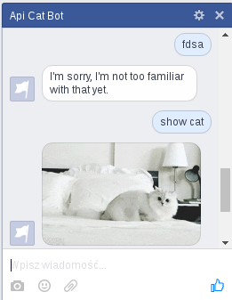
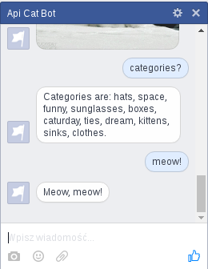
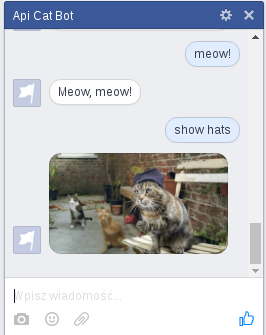

class: center, middle

# Conversational Bots
### for Facebook Messenger
.author[by Łukasz Wieczorek]
---

# Agenda

1. Introduction
2. Facebook Messenger Platform
3. Cat Bot
4. wit.ai
5. api.ai
6. Microsoft Bot Framework
7. Summary

---

# Introduction

Old times:
* [Cleverbot](http://www.cleverbot.com/)
* [Akinator](http://akinator.com/)
* [List of Chat Bots](http://ai.wikia.com/wiki/List_Of_Chat_Bots)

New times:
* [2016 will be the year of conversational commerce @ medium.com](https://medium.com/chris-messina/2016-will-be-the-year-of-conversational-commerce-1586e85e3991)
* [Microsoft's Tay is an Example of Bad Design @ medium.com](https://medium.com/@carolinesinders/microsoft-s-tay-is-an-example-of-bad-design-d4e65bb2569f)
* [wit.ai](https://wit.ai/)
* [api.ai](https://api.ai/)
* [Microsoft Bot Framework](https://dev.botframework.com/)

---

# Facebook Messenger Platform

* Facebook Page (send message) & Application (Messenger, webhooks)

* `express` — hooks for Messenger API

  `GET /webhook` — challene-response authentication

  `POST /webhook` — new message hook
    * read the message
    * send the message to the bot API
    * return the formatted bot API response to sender

* `request` — post request to Messenger API

```js
{
  "recipient": "...",
  "message": {...}
}
```

---

# Cat Bot

Functionality:

* Conversation on Facebook Messenger
* Uses [thecatapi](http://thecatapi.com/)
  * `/api/images/get`
  * `/api/images/get?category=$category`
  * `/api/categories/list`
* Chat functionality:
  * Show random cat image
  * Reply with "meow" text
  * List cat image categories as text
  * Show cat image from requested category
* Server functionality:
  * Cat images sent counter

---

class: center

# Works like this, meow!





---

# wit.ai

Why?
* Mentioned on Facebook developer pages
* Free even for commercial use
* Many languages supported
* Binding for popular programming languages (JavaScript, Python, Ruby)

How?
* Inbox — new expressions to analyse
* Stories — requests with responses, context, entities, actions, variables
* Actions — actions in code
* Understanding — entity values and search strategies
* Logs — message, context, actions

---

# Entities

* Trait — derived from whole sentence
  * Intent
  * Sentiment
  * Politeness
* Free Text — not predefined message substring
  *	Message Body
  * Contact Name
* Keywords — value from predefined list
  * Country
  * Burger
  * Room

---

background-image: url(images/wit-inbox.png)
class: center

# Inbox

---

background-image: url(images/wit-stories-1.png)
class: center

# Stories (1)

---

background-image: url(images/wit-stories-2.png)
class: center

# Stories (2)

---

background-image: url(images/wit-stories-3.png)
class: center

# Stories (3)

---

background-image: url(images/wit-actions.png)
class: center

# Actions

---

background-image: url(images/wit-understanding.png)
class: center

# Understanding

---

background-image: url(images/wit-logs.png)
class: center

# Logs

---

# Server custom code (1)

```js

var CAT_COUNTER = 0;

const actions = {
  ...
  merge(sessionId, context, entities, message, cb) {
    var isImage = false;
    if (firstEntityValue(entities, "isImage") == 'true') {
      isImage = true;
    }
    context.isImage = isImage;
    cb(context);
  },
  counter(sessionId, context, cb) {
    CAT_COUNTER += 1;
    console.log(CAT_COUNTER + ' cats served');
    cb();
  }
}
```

---

# Server custom code (2)

```js
const fbMessage = (recipientId, msg, cb) => {
  var message;
  if (!msg.isImage) {
    message = {
      text: msg.text
    };
  } else {
    message = {
      attachment: {
        type: 'image',
        payload: {
          url: msg.text
        }
      }
    };
  }
  ...
}
```

---

# [api.ai](https://api.ai/)

What?
* Commercial solution
* Free with limited queries, public agents, limited features
* 13 langauges

How?
* Agents — applications
* Entities — concepts specific to a domain
* Intents — mapping between user input and software actions
* Actions — triggered by intents
* Contexts — converstaion state

---

background-image: url(images/api-intents-1.png)
class: center

# Intents (1)

---

background-image: url(images/api-intents-2.png)
class: center

# Intents (2)

---

background-image: url(images/api-intents-3.png)
class: center

# Intents (3)

---

background-image: url(images/api-intents-4.png)
class: center

# Intents (4)

---

background-image: url(images/api-intents-5.png)
class: center

# Intents (5)

---

background-image: url(images/api-entities.png)
class: center

# Entities

---

background-image: url(images/api-logs.png)
class: center

# Logs

---

background-image: url(images/api-domains.png)
class: center

# Domains

---

# Custom server code (1)

```js
let CAT_COUNTER = 0;
const actions = {
  counter() {
    CAT_COUNTER += 1;
    console.log(CAT_COUNTER + ' cats served');
  }
}
```

```js
function processEvent(event) {
  ...
        let action = response.result.action;

        if (action in actions) {
          actions[action]();
        }
  ...
}
```

---

# Custom server code (2)

```js
let isImage = response.result.parameters.isImage === 'true';
if (!isImage) {
  var splittedText = splitResponse(responseText);

  for (var i = 0; i < splittedText.length; i++) {
    sendFBMessage(sender, {
      text: splittedText[i]
    });
  }
} else {
  let message = {
    attachment: {
      type: 'image',
      payload: {
        url: responseText
      }
    }
  };
  sendFBMessage(sender, message);
}
```

---

# [Microsoft Bot Framework](https://dev.botframework.com/)

What?
* Paired with [LUIS](https://www.luis.ai)
* More than 30 languages (5 in LUIS)
* Good documentation [here](http://docs.botframework.com/sdkreference/nodejs/modules/_botbuilder_d_.html) and [here](https://www.luis.ai/Help)

How?
* Bot connector — integrations
* Bot Builder SDK — JavaScript/C# tools
* Bot Directory (soon) — bot marketplace
* Separation of language understanding engine and responses
* Reviews, waiting, Microsoft please don't stay in touch

---

background-image: url(images/microsoft-botframework.png)
class: center

# Bot framework

---

background-image: url(images/microsoft-entities.png)
class: center

# Entities

---

background-image: url(images/microsoft-intents-1.png)
class: center

# Intents(1)

---

background-image: url(images/microsoft-intents-2.png)
class: center

# Intents (2)

---

background-image: url(images/microsoft-utterances.png)
class: center

# Utterances

---

background-image: url(images/microsoft-suggest.png)
class: center

# Suggest

---

# Server custom code (1)

```js
if (DEBUG) {
  bot = new builder.TextBot();
} else {
  bot = new builder.BotConnectorBot({
    appId: config.appId,
    appSecret: config.appSecret
  });
}

bot.add('/', dialog);

if (DEBUG) {
  bot.listenStdin();
} else {
  var server = restify.createServer();
  server.post('/api/messages', bot.verifyBotFramework(), bot.listen());
  server.listen(process.env.port || 8445, function() {
    console.log('%s listening to %s', server.name, server.url);
  });
}
```

---

# Server custom code (2)

```js
function composeMessage(text, session) {
  return new builder.Message().setText(session, text).addAttachment({
    contentType: 'image/*', contentUrl: text
  });
}
var dialog = new builder.LuisDialog(config.luis);
dialog.on('Meow', builder.DialogAction.send(strings.Meow));
dialog.on('Categories', builder.DialogAction.send(strings.Categories));
dialog.on('Cat', function(session, args) {
  session.send(composeMessage(strings.Cat, session));
});
dialog.on('Category', function(session, args) {
  var entity = builder.EntityRecognizer.findEntity(args.entities, 'category')
  if (entity) {
    var category = entity['entity'];
    var text = strings.Category + category;
    var message = composeMessage(text, session);
    session.send(message);
  } else {
    session.send('Could not find such category.');
  }
});
```

---

# What topics can I possibly touch with this?

* Booking
* Company information
* Jokes
* Comforting
* Help desk
* Weather
* Monitoring
* Learning
* Police reports
* etc.

---

# Good & bad parts

* wit.ai
  * free
  * clean user interface
  * good context handling
  * entity class choice
  * text only parameters
* api.ai
  * lists for intent requests and responses
  * entity synonyms
  * knowledge domains
  * speech recognition and playback
  * active support
  * text only parameters
* Microsoft
  * ugly user interface
  * orienatation for code
  * manual utterance training
  * entity can contain maximum 10 values

---

# Other solutions

* [Pandorabots](http://www.pandorabots.com/)
* [Pingup](http://pingup.com/developers/)
* [OneBotAPI](http://www.onebotapi.com/)
* and others not high in Google Search results

---

class: center, middle

# Source code

[GitHub repository](https://github.com/wieczorek1990/cbots)

[Online presentation](http://wieczorek1990.github.io/cbots/presentation)

---

background-image: url(images/cat.png)
class: center, bottom

# Thanks
### Questions please
